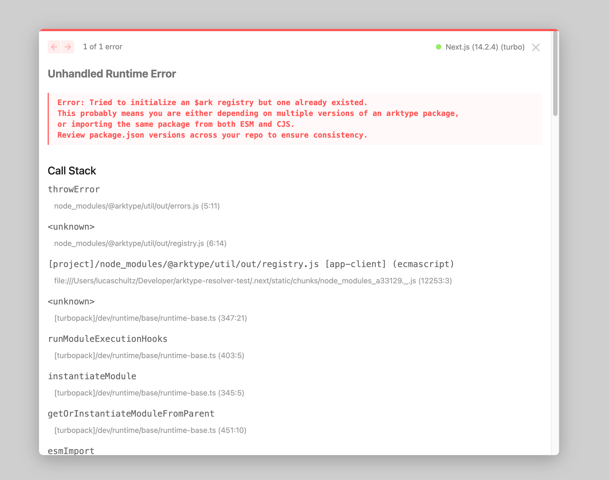

# Arktype Resolver Bug



This repository is a minimal reproduction of a bug with the `arktypeResolver` in the [`@hookform/resolvers`](https://github.com/react-hook-form/resolvers) package.

## How To Reproduce

To reproduce the bug, install the dependencies:

```bash
npm install
```

Run the development server:

```bash
npm run dev
```

Open [http://localhost:3000](http://localhost:3000) with your browser to be greated with an error message.
